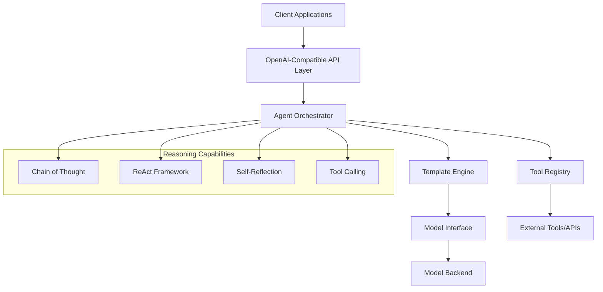

# Mistral.rs Agent Architecture

This document outlines the comprehensive architecture for building and deploying AI agents using Mistral.rs. The architecture combines various reasoning capabilities (Chain of Thought, ReAct, Self-Reflection) with tool calling in a modular, extensible system.

## System Overview

The architecture consists of several key components:



## Core Components

### 1. OpenAI-Compatible API Layer

```python
# api/main.py
from robyn import Robyn
from attrs import define
from typing import List, Optional

@define
class ChatCompletionRequest:
    messages: List[dict]
    functions: Optional[List[dict]] = None
    template: Optional[str] = None
    capabilities: Optional[List[str]] = None

app = Robyn(__name__)

@app.post("/v1/chat/completions")
async def chat_completions(request: ChatCompletionRequest):
    # Route to appropriate agent based on capabilities
    agent = AgentOrchestrator.create(
        template=request.template,
        capabilities=request.capabilities
    )
    
    response = await agent.process(
        messages=request.messages,
        functions=request.functions
    )
    
    return format_openai_response(response)
```

### 2. Agent Orchestrator

```rust
// src/orchestrator.rs
pub struct AgentOrchestrator {
    template_engine: TemplateEngine,
    tool_registry: ToolRegistry,
    capabilities: Vec<Capability>,
}

impl AgentOrchestrator {
    pub fn new(config: Config) -> Self {
        Self {
            template_engine: TemplateEngine::new(config.templates),
            tool_registry: ToolRegistry::new(config.tools),
            capabilities: config.capabilities,
        }
    }
    
    pub async fn process(&self, request: Request) -> Result<Response> {
        // 1. Load appropriate templates
        let templates = self.template_engine.load_templates(&request.capabilities);
        
        // 2. Initialize reasoning capabilities
        let reasoner = self.initialize_reasoner(&request.capabilities);
        
        // 3. Process request through reasoning pipeline
        let response = reasoner.process(request, &self.tool_registry).await?;
        
        Ok(response)
    }
}
```

### 3. Template Engine

```rust
// src/template.rs
pub struct TemplateEngine {
    templates: HashMap<String, Template>,
}

impl TemplateEngine {
    pub fn load_templates(&self, capabilities: &[Capability]) -> Vec<Template> {
        let mut templates = Vec::new();
        
        // Load base template
        templates.push(self.templates.get("base").unwrap().clone());
        
        // Load capability-specific templates
        for capability in capabilities {
            if let Some(template) = self.templates.get(capability.name()) {
                templates.push(template.clone());
            }
        }
        
        templates
    }
}
```

### 4. Tool Registry

```rust
// src/tools.rs
pub struct ToolRegistry {
    tools: HashMap<String, Box<dyn Tool>>,
}

impl ToolRegistry {
    pub async fn execute_tool(&self, call: ToolCall) -> Result<Value> {
        let tool = self.tools.get(&call.name)
            .ok_or(Error::ToolNotFound(call.name))?;
            
        tool.execute(call.parameters).await
    }
}
```

## Reasoning Capabilities Integration

### 1. Chain of Thought

```rust
// src/reasoning/cot.rs
pub struct ChainOfThought {
    template: Template,
}

impl Reasoner for ChainOfThought {
    async fn process(&self, input: &str) -> Result<String> {
        let steps = vec![
            "Understand the question",
            "Break down into steps",
            "Solve each step",
            "Verify solution",
        ];
        
        let mut response = String::new();
        for step in steps {
            response.push_str(&format!("\n{}: ", step));
            response.push_str(&self.think(step, input).await?);
        }
        
        Ok(response)
    }
}
```

### 2. ReAct Framework

```rust
// src/reasoning/react.rs
pub struct ReAct {
    template: Template,
    tool_registry: ToolRegistry,
}

impl Reasoner for ReAct {
    async fn process(&self, input: &str) -> Result<String> {
        let mut state = State::new(input);
        
        while !state.is_complete() {
            // Think
            let thought = self.think(&state).await?;
            state.add_thought(thought);
            
            // Act
            let action = self.plan_action(&state).await?;
            let result = self.tool_registry.execute_tool(action).await?;
            state.add_observation(result);
            
            // Reflect
            let reflection = self.reflect(&state).await?;
            state.add_reflection(reflection);
        }
        
        Ok(state.generate_response())
    }
}
```

### 3. Self-Reflection

```rust
// src/reasoning/reflection.rs
pub struct SelfReflection {
    template: Template,
    confidence_threshold: f32,
}

impl Reasoner for SelfReflection {
    async fn process(&self, input: &str) -> Result<String> {
        let initial_response = self.generate_response(input).await?;
        let evaluation = self.evaluate_response(&initial_response).await?;
        
        if evaluation.confidence < self.confidence_threshold {
            let improved_response = self.improve_response(
                &initial_response,
                &evaluation
            ).await?;
            Ok(improved_response)
        } else {
            Ok(initial_response)
        }
    }
}
```

## Deployment Configuration

### 1. Docker Compose Setup

```yaml
# docker-compose.yml
version: '3.8'
services:
  api:
    build: ./api
    ports:
      - "8000:8000"
    environment:
      - MISTRAL_URL=http://mistral:8080
    depends_on:
      - mistral
      - tools

  mistral:
    image: tribehealth/mistral-rs-cuda:latest
    volumes:
      - ./templates:/app/templates
      - ./models:/app/models
    environment:
      - MODEL_PATH=/app/models/mistral-7b
      - TEMPLATE_PATH=/app/templates
    deploy:
      resources:
        reservations:
          devices:
            - driver: nvidia
              count: 1
              capabilities: [gpu]

  tools:
    build: ./tools
    ports:
      - "8001:8001"
    environment:
      - TOOL_CONFIG=/app/config/tools.yaml
```

### 2. Kubernetes Deployment

```yaml
# k8s/deployment.yaml
apiVersion: apps/v1
kind: Deployment
metadata:
  name: mistral-agent
spec:
  replicas: 3
  template:
    spec:
      containers:
        - name: api
          image: mistral-api:latest
          resources:
            limits:
              memory: "1Gi"
              cpu: "500m"
          
        - name: mistral
          image: tribehealth/mistral-rs-cuda:latest
          resources:
            limits:
              nvidia.com/gpu: 1
          volumeMounts:
            - name: models
              mountPath: /app/models
            - name: templates
              mountPath: /app/templates
```

## Testing Strategy

### 1. Unit Tests

```rust
// tests/reasoning.rs
#[cfg(test)]
mod tests {
    use super::*;

    #[tokio::test]
    async fn test_chain_of_thought() {
        let reasoner = ChainOfThought::new(mock_template());
        let result = reasoner.process("What is 2 + 2?").await.unwrap();
        assert!(result.contains("Let's solve this step by step"));
    }

    #[tokio::test]
    async fn test_react_framework() {
        let reasoner = ReAct::new(mock_template(), mock_tool_registry());
        let result = reasoner.process("Get weather in London").await.unwrap();
        assert!(result.contains("TOOL_CALL"));
    }
}
```

### 2. Integration Tests

```python
# tests/integration/test_api.py
async def test_complete_pipeline():
    client = TestClient(app)
    
    response = await client.post("/v1/chat/completions", json={
        "messages": [{
            "role": "user",
            "content": "What's the weather in London?"
        }],
        "capabilities": ["react", "self_reflection"]
    })
    
    assert response.status_code == 200
    data = response.json()
    assert "choices" in data
    assert len(data["choices"]) > 0
```

### 3. Load Testing

```python
# tests/load/locustfile.py
from locust import HttpUser, task, between

class AgentUser(HttpUser):
    wait_time = between(1, 3)

    @task
    def test_chat_completion(self):
        self.client.post("/v1/chat/completions", json={
            "messages": [{
                "role": "user",
                "content": "Simple calculation: 2 + 2"
            }],
            "capabilities": ["chain_of_thought"]
        })
```

## Monitoring and Observability

### 1. Metrics Collection

```rust
// src/metrics.rs
pub struct Metrics {
    request_counter: Counter,
    latency_histogram: Histogram,
    tool_usage_counter: CounterVec,
}

impl Metrics {
    pub fn record_request(&self, capabilities: &[String]) {
        self.request_counter.inc();
        for capability in capabilities {
            self.capability_counter.with_label_values(&[capability]).inc();
        }
    }
}
```

### 2. Logging Configuration

```yaml
# config/logging.yaml
logging:
  level: INFO
  handlers:
    - type: console
      format: json
    - type: file
      path: /var/log/mistral/agent.log
      rotation: daily
  metrics:
    push_gateway: http://prometheus:9091
    job_name: mistral_agent
```

## Security Considerations

1. **Authentication**
   - API key validation
   - JWT token support
   - Role-based access control

2. **Input Validation**
   - Request sanitization
   - Template validation
   - Tool parameter verification

3. **Rate Limiting**
   - Per-user limits
   - Per-endpoint limits
   - Burst handling

4. **Audit Logging**
   - Request tracking
   - Tool usage logging
   - Error reporting

## Development Workflow

1. **Local Development**
   ```bash
   # Start development environment
   docker-compose -f docker-compose.dev.yml up
   
   # Run tests
   cargo test
   pytest tests/
   
   # Format code
   cargo fmt
   black api/
   ```

2. **CI/CD Pipeline**
   ```yaml
   # .github/workflows/ci.yml
   name: CI
   on: [push, pull_request]
   
   jobs:
     test:
       runs-on: ubuntu-latest
       steps:
         - uses: actions/checkout@v2
         - name: Run tests
           run: |
             cargo test
             pytest tests/
         
     deploy:
       needs: test
       runs-on: ubuntu-latest
       steps:
         - name: Deploy to production
           if: github.ref == 'refs/heads/main'
           run: |
             docker-compose -f docker-compose.prod.yml build
             docker-compose -f docker-compose.prod.yml push
   ```

## Future Enhancements

1. **Advanced Capabilities**
   - Multi-agent collaboration
   - Long-term memory
   - Learning from feedback
   - Dynamic tool discovery

2. **Performance Optimizations**
   - Response streaming
   - Batch processing
   - Caching strategies
   - Load balancing

3. **Developer Tools**
   - Template editor
   - Debugging interface
   - Performance profiler
   - Documentation generator

## Contributing

1. **Setup Development Environment**
   ```bash
   # Clone repository
   git clone https://github.com/yourusername/mistral-agent.git
   cd mistral-agent
   
   # Install dependencies
   cargo build
   pip install -r requirements.txt
   
   # Run development server
   cargo run --bin mistral-agent
   ```

2. **Submit Changes**
   - Fork repository
   - Create feature branch
   - Submit pull request
   - Add tests and documentation

## License

This project is licensed under the MIT License - see the LICENSE file for details.
