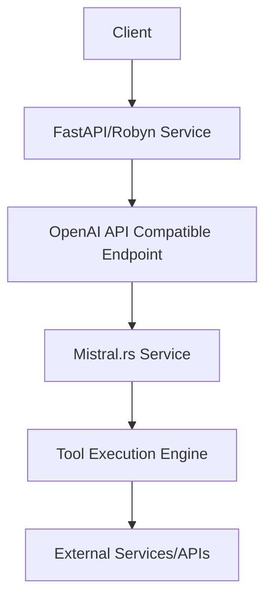

# Tool Calling Implementation Guide

This document outlines how to implement tool calling capabilities in Mistral.rs using the template system, including model-specific implementations, deployment strategies, and testing approaches.

## Overview

Tool calling enables language models to interact with external functions and APIs. This implementation guide covers:
1. Template-based tool calling
2. Model-specific considerations
3. OpenAI-compatible API implementation
4. Deployment and testing strategies

## Model Support Matrix

| Model | Native Tool Calling | Template-Based | Notes |
|-------|-------------------|----------------|--------|
| Mistral 7B | No | Yes | Requires careful prompting |
| Mixtral 8x7B | Yes | Yes | Best with function calling template |
| Llama 2 | No | Yes | Works with structured prompts |
| CodeLlama | Yes | Yes | Optimized for code-related tools |
| Phi-2 | No | Yes | Limited tool complexity |

## Template Implementation

### 1. Basic Tool Calling Template

```json
{
    "chat_template": "{{ bos_token }}<<SYS>>
You are an AI assistant with access to the following tools:

TOOLS = {
    "weather": {
        "description": "Get current weather",
        "params": {
            "location": "string",
            "units": "celsius|fahrenheit"
        }
    },
    "calculator": {
        "description": "Perform calculations",
        "params": {
            "expression": "string"
        }
    }
}

When you need to use a tool, format your response as:
TOOL_CALL: {
    "name": "tool_name",
    "params": {
        "param1": "value1"
    }
}
<</SYS>>[INST] {{ message['content'] }} [/INST]
Let me help you with that.

{{ message['content'] }}

TOOL_CALL: {{ message['tool_call'] | json_encode }}{{ eos_token }}"
}
```

### 2. OpenAI-Compatible Function Calling Template

```json
{
    "chat_template": "{{ bos_token }}<<SYS>>
You can call functions using the following format:

{
    "function": {
        "name": "function_name",
        "arguments": {
            "arg1": "value1",
            "arg2": "value2"
        }
    }
}

Available functions:
{{ functions | json_encode }}
<</SYS>>[INST] {{ message['content'] }} [/INST]
{{ message['content'] }}

Function call: {{ message['function_call'] | json_encode }}{{ eos_token }}"
}
```

## Implementation Examples

### 1. Weather Service Integration

```python
# Python FastAPI service with Robyn
from robyn import Robyn
from attrs import define
from typing import Optional, Dict

@define
class WeatherRequest:
    location: str
    units: Optional[str] = "celsius"

app = Robyn(__name__)

@app.get("/weather")
async def get_weather(request: WeatherRequest) -> Dict:
    # Implementation
    return {"temperature": 20, "conditions": "sunny"}

# Mistral.rs integration
async fn process_tool_call(tool_call: ToolCall) -> Result<String> {
    match tool_call.name.as_str() {
        "weather" => {
            let params = tool_call.params;
            let response = reqwest::get(format!(
                "http://localhost:8000/weather?location={}&units={}",
                params["location"], params.get("units").unwrap_or("celsius")
            )).await?;
            Ok(response.text().await?)
        }
        _ => Err(anyhow!("Unknown tool")),
    }
}
```

### 2. Calculator Implementation

```rust
#[derive(Tool)]
struct Calculator {
    async fn execute(&self, expression: &str) -> Result<f64> {
        // Implementation using a safe expression evaluator
        evaluate_expression(expression)
    }
}

// Template usage
let calc_template = json!({
    "name": "calculator",
    "description": "Perform calculations",
    "parameters": {
        "type": "object",
        "properties": {
            "expression": {
                "type": "string",
                "description": "Mathematical expression to evaluate"
            }
        }
    }
});
```

## Model-Specific Implementations

### 1. Mistral 7B (Template-Based)

```json
{
    "chat_template": "{{ bos_token }}<<SYS>>
You are a helpful assistant. When you need to perform calculations or get information,
use the following format:

TOOL_CALL: {
    "name": "tool_name",
    "params": {}
}
<</SYS>>"
}
```

### 2. Mixtral 8x7B (Native Support)

```json
{
    "chat_template": "{{ bos_token }}<<SYS>>
You have access to these functions:
{{ functions | json_encode }}

Use them by responding with:
<function_call>name=function_name arguments={"arg": "value"}</function_call>
<</SYS>>"
}
```

## Deployment Architecture



### FastAPI Service Implementation

```python
from fastapi import FastAPI
from pydantic import BaseModel
from typing import List, Optional

app = FastAPI()

class Function(BaseModel):
    name: str
    description: str
    parameters: dict

class ChatMessage(BaseModel):
    role: str
    content: str
    function_call: Optional[dict] = None

class ChatRequest(BaseModel):
    messages: List[ChatMessage]
    functions: Optional[List[Function]] = None
    function_call: Optional[str] = None

@app.post("/v1/chat/completions")
async def chat_completions(request: ChatRequest):
    # Forward to Mistral.rs service
    response = await mistral_client.generate(
        messages=request.messages,
        functions=request.functions
    )
    return {
        "id": "chatcmpl-123",
        "object": "chat.completion",
        "created": int(time.time()),
        "model": "mistral-7b",
        "choices": [{
            "index": 0,
            "message": response,
            "finish_reason": "stop"
        }]
    }
```

### Docker Deployment

```yaml
version: '3.8'
services:
  api:
    build: ./api
    ports:
      - "8000:8000"
    environment:
      - MISTRAL_SERVICE_URL=http://mistral:8080
    depends_on:
      - mistral

  mistral:
    image: tribehealth/mistral-rs-cuda:latest
    volumes:
      - ./templates:/app/templates
      - ./models:/app/models
    environment:
      - ENABLE_TOOL_CALLING=true
      - MAX_TOKENS=2048
    deploy:
      resources:
        reservations:
          devices:
            - driver: nvidia
              count: 1
              capabilities: [gpu]
```

## Testing Strategy

### 1. Unit Tests

```python
# test_tool_calling.py
import pytest
from your_api import app
from fastapi.testclient import TestClient

client = TestClient(app)

def test_weather_tool():
    response = client.post("/v1/chat/completions", json={
        "messages": [{
            "role": "user",
            "content": "What's the weather in London?"
        }],
        "functions": [{
            "name": "get_weather",
            "description": "Get weather information",
            "parameters": {
                "type": "object",
                "properties": {
                    "location": {"type": "string"},
                    "units": {"type": "string"}
                }
            }
        }]
    })
    assert response.status_code == 200
    assert "function_call" in response.json()["choices"][0]["message"]
```

### 2. Integration Tests

```python
# test_integration.py
async def test_end_to_end_flow():
    # Test complete flow from API to tool execution
    response = await client.post("/v1/chat/completions", json={
        "messages": [{
            "role": "user",
            "content": "Calculate 2 + 2 and then get the weather in London"
        }]
    })
    
    result = response.json()
    assert len(result["choices"]) > 0
    assert "function_call" in result["choices"][0]["message"]
```

### 3. Load Testing

```python
# locustfile.py
from locust import HttpUser, task, between

class ToolCallingUser(HttpUser):
    wait_time = between(1, 3)

    @task
    def test_tool_calling(self):
        self.client.post("/v1/chat/completions", json={
            "messages": [{
                "role": "user",
                "content": "What's 2 + 2?"
            }],
            "functions": [{
                "name": "calculator",
                "description": "Calculate mathematical expressions",
                "parameters": {
                    "type": "object",
                    "properties": {
                        "expression": {"type": "string"}
                    }
                }
            }]
        })
```

## Best Practices

1. **Tool Design**
   - Clear, atomic functionality
   - Well-defined schemas
   - Comprehensive error handling
   - Input validation

2. **Template Management**
   - Version control
   - Model-specific variations
   - Fallback handling
   - Performance optimization

3. **Security**
   - Input sanitization
   - Rate limiting
   - Authentication
   - Audit logging

4. **Monitoring**
   - Tool usage metrics
   - Error rates
   - Response times
   - Resource utilization

## Future Enhancements

1. **Advanced Features**
   - Tool chaining
   - Parallel execution
   - Context awareness
   - Result caching

2. **Integration Options**
   - More model support
   - Custom tool types
   - Plugin system
   - Event streaming

3. **Development Tools**
   - Template editor
   - Testing framework
   - Monitoring dashboard
   - Documentation generator